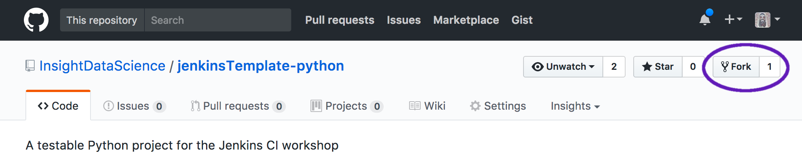
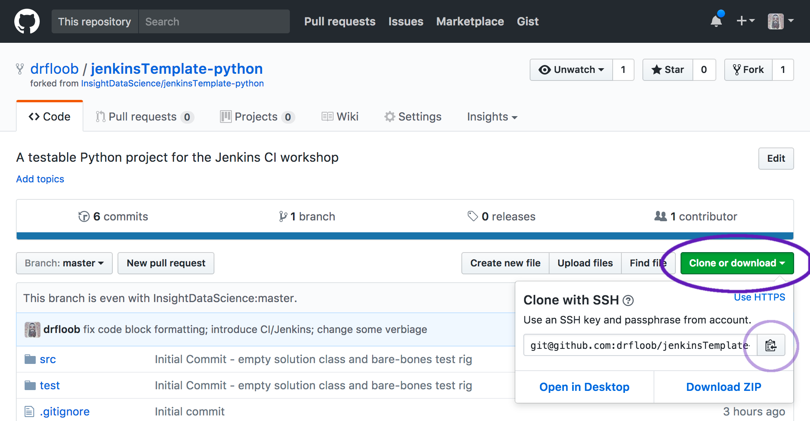
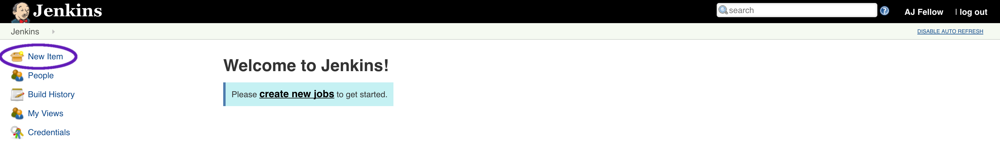
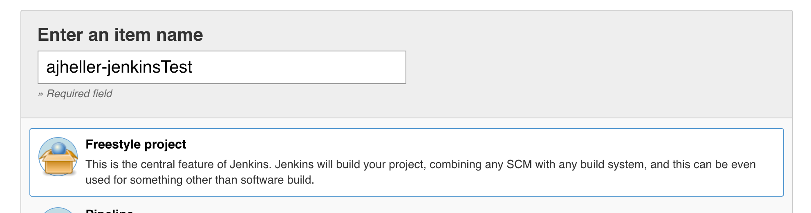
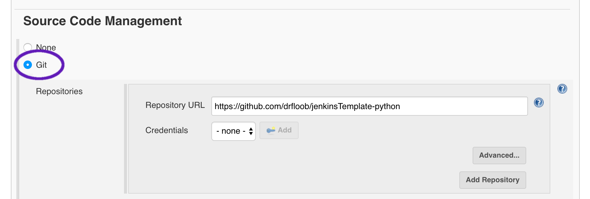
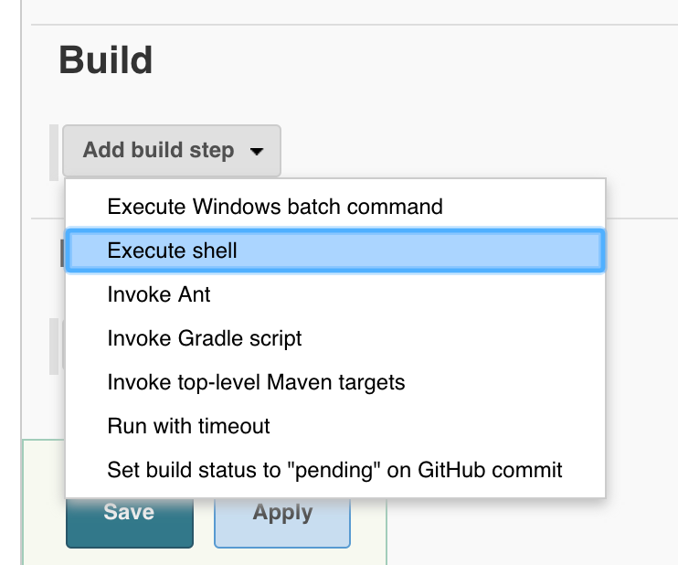

# jenkinsTemplate-python
A testable Python project for the Jenkins CI workshop @ Insight Data Engineering.

 * [Part 0: Getting Started](#part-0-getting-started)
 * [Part 1: Problem Statement](#part-1-problem-statement)
 * [Part 2: Implement and Test](#part-2-implement-and-test)
 * [Part 3: Jenkins](#part-3-jenkins-continuous-integration)
 * [Part 4: TDD](#part-4-tdd)

----

## Part 0: Getting Started

To begin, fork this repo on GitHub ...

<kbd></kbd>

... then clone it to your local machine by copying the clone link ...

<kbd></kbd>

Finally, use `git clone` at your shell / command line with the clone link you just copied. The command will look something like this:

```bash
git clone git@github.com:[MY_USER]/jenkinsTemplate-python.git
```


## Part 1: Problem Statement

Given an array of *2n* integers, your task is to group these integers into *n* pairs of integers, say *(a<sub>1</sub>, b<sub>1</sub>), (a<sub>2</sub>, b<sub>2</sub>), ..., (a<sub>n</sub>, b<sub>n</sub>)* which makes the sum of *min(a<sub>i</sub>, b<sub>i</sub>)* for all *i* from *1* to *n* as large as possible.

### Example

 * **Input:** [1,4,3,2]
 * **Output:** 4
 * **Explanation:** n is 2, and the maximum sum of pairs is 4.


### Notes

 * n is a positive integer, which is in the range of [1, 10000].
 * All the integers in the array will be in the range of [-10000, 10000].


## Part 2: Implement and Test

Your first job is to implement a working solution that passes the given test. To do so, modify the code in `src/arrayPartition1.py`.

Testing is performed by calling `./runTests.py` from your shell / command line.

If you've implemented a correct solution, the output should look like this:

```bash
$ ./runTests.py
.
----------------------------------------------------------------------
Ran 1 test in 0.000s

OK
```

When you're finished and your test passes, be sure to push your changes back up to GitHub. Here is a rough outline of how to do it:

 * `git status` will show you which files have changed or been added
 * `git add [FILENAME] ...` will mark specific files to be committed and sent back to github
 * `git commit` will commit your changes locally and allow you to describe what changed in your commit message
 * `git push` will send your locally committed changes back to GitHub


## Part 3: Jenkins Continuous Integration

Now that you have a working solution, let's make sure that whenever you change your code and push it back to GitHub, it remains executable and that all of your tests still pass.

Jenkins is a popular Open Source tool for Continuous Integration and Continuous Delivery. Since we're not working with collaborators or deploying our code to a server yet, we'll be using Jenkins for Continuous Testing alone.

As part of this workshop, you should have received an email with your username, password, and link to our internal Jenkins server. Use the link to log in to Jenkins. On the homepage, click the link on the left that says **New Item**

<kbd></kbd>

In the New Item configuration screen, set the name of the project to `[MY_USERNAME]-jenkinsTest`, then click the box underneath titled **Freestyle project**, and finally click **OK** at the bottom of the page.

<kbd></kbd>

On the project configuration screen, under **Source Code Management**, select the **Git** list item and enter the URL of your github repository page (Note: *not* the git clone URL). This tells Jenkins where it can get your code from (GitHub) and how to do it (using `git clone`).

<kbd></kbd>

Now that Jenkins knows how to get a copy of your code, it needs to know how to test it. Further down the page, you'll find the **Build** section. Click on **Add build step**, then **Execute shell**.

<kbd></kbd>

In the command window that appears, type: `./runTests.py`.


## Part 4: TDD
